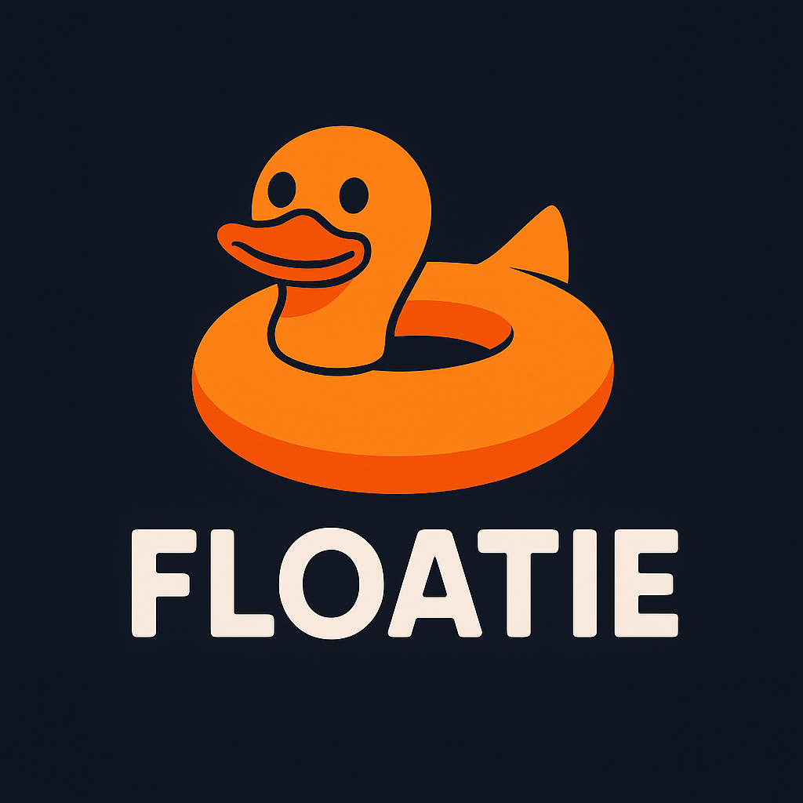

<div align="center">
  
  
  # Floatie
  
  ### Stay afloat in containerized environments with eBPF-powered monitoring
  
  [](https://www.gnu.org/licenses/gpl-3.0)
  [](https://www.kernel.org/)
  [](https://ebpf.io/)
  [](https://prometheus.io/)
  
</div>

Floatie is an eBPF-powered observability tool for monitoring container performance. It uses eBPF probes to provide insights into overlayFS latency and OOM kill events, helping you stay afloat in the chaotic seas of containerized environments. 

**Why Floatie?** Just as a swimming floatie keeps you buoyant in water, this tool keeps your containers observable and monitored with minimal overhead. Deploy it directly inside your containers for real-time insights into storage and memory performance.

## Features

- **OverlayFS Monitoring**: Track read and write latencies in containerized overlayFS operations
- **OOM Kill Detection**: Capture detailed information about Out-of-Memory events including trigger and victim processes
- **Prometheus Integration**: Export metrics for integration with your existing monitoring stack
- **Container-Aware**: Filter events by PID namespace to focus on specific containers
- **Lightweight**: Minimal overhead using efficient eBPF programs

## Requirements

- Linux kernel 5.8+ (for BPF ring buffer support)
- `CAP_BPF`, `CAP_SYS_ADMIN`, and `CAP_SYS_RESOURCE` capabilities
- Mount access to `/sys/kernel/debug`, `/sys/fs/bpf`, and `/sys/fs/cgroup`

## Installation

```bash
# Clone the repository
git clone https://github.com/yourusername/floatie.git
cd floatie

# Build the binary
go generate ./...
go build -o floatie ./cmd/floatie

# Or use Docker
docker build -t floatie:latest .
```

## Usage

### Standalone Mode

```bash
# Run directly
sudo ./floatie --pid-ns-inum 0 --max-map-entries 1024

# Or run with Docker
docker run --rm -it \
    --cap-add=SYS_ADMIN,SYS_RESOURCE,BPF \
    --pid=host \
    -v /sys/kernel/debug:/sys/kernel/debug \
    -v /sys/fs/bpf:/sys/fs/bpf \
    -v /sys/fs/cgroup:/sys/fs/cgroup \
    -p 9090:9090 \
    floatie:latest --pid-ns-inum 0 --max-map-entries 1024
```

Access Prometheus metrics at `http://localhost:9090/metrics`

### Embedded In Your Application Container

For best integration, embed Floatie directly in your application container:

```dockerfile
# Stage 1: Build Floatie
FROM ubuntu:22.04 as floatie-builder

# Install dependencies and build Floatie
# ...

# Stage 2: Your application with Floatie
FROM python:3.11-slim

# Copy Floatie binary
COPY --from=floatie-builder /build/floatie/floatie /usr/local/bin/floatie

# Your application setup
# ...

# Start script that runs both Floatie and your app
ENTRYPOINT ["/start.sh"]
```

Start script (`start.sh`):
```bash
#!/bin/bash
# Start Floatie in the background
floatie --pid-ns-inum=0 --max-map-entries=1024 &

# Start your application
python /app/main.py
```

See the [embedded example](examples/embedded/) for a complete implementation.

## Available Metrics

| Metric | Type | Description |
|--------|------|-------------|
| `floatie_overlayfs_read_latency_us` | Histogram | Read latency in microseconds |
| `floatie_overlayfs_write_latency_us` | Histogram | Write latency in microseconds |
| `floatie_oom_kills_total` | Counter | Total number of OOM kill events |
| `floatie_memory_pressure_score` | Gauge | Current memory pressure score (0-100) |

## License

This project is licensed under the [GNU General Public License v3.0](LICENSE) - see the LICENSE file for details.